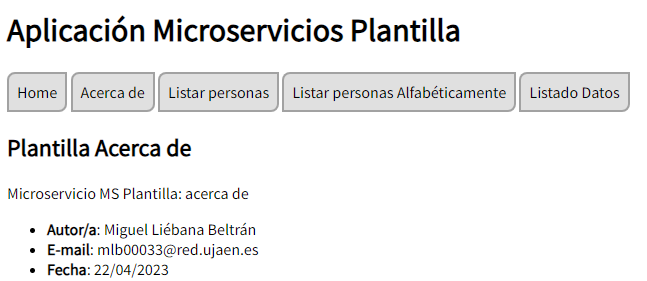
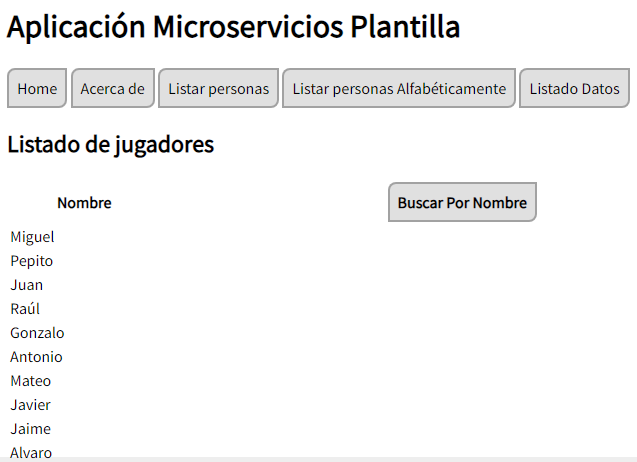
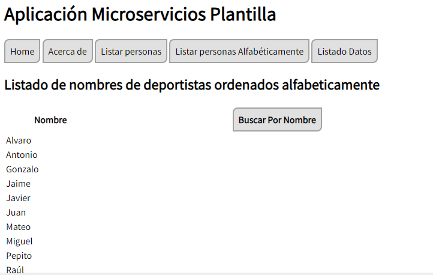
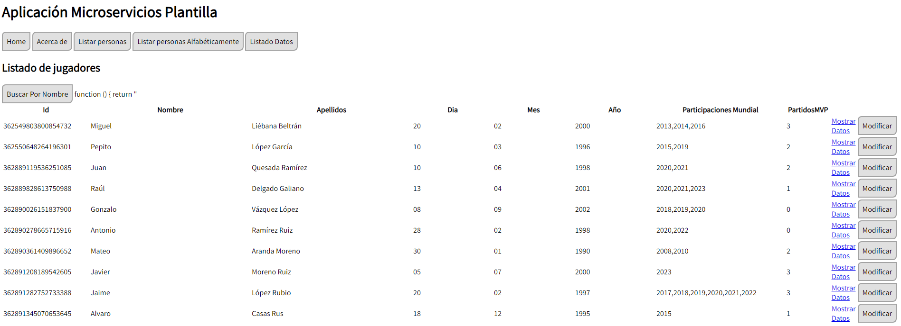
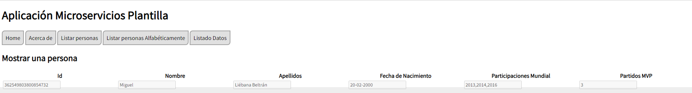
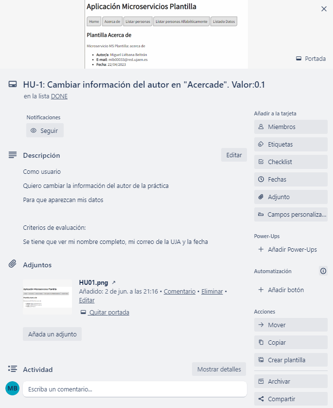
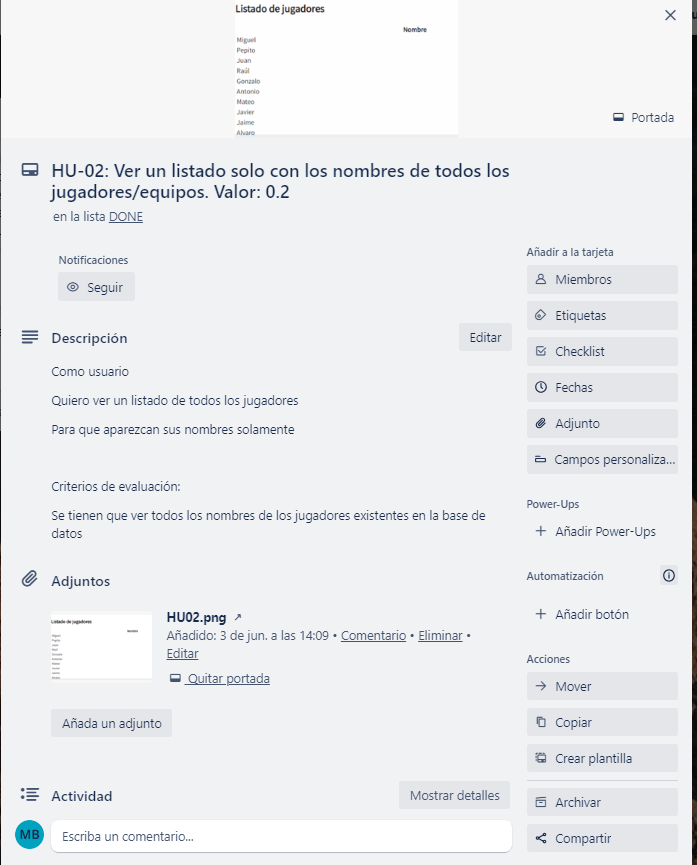
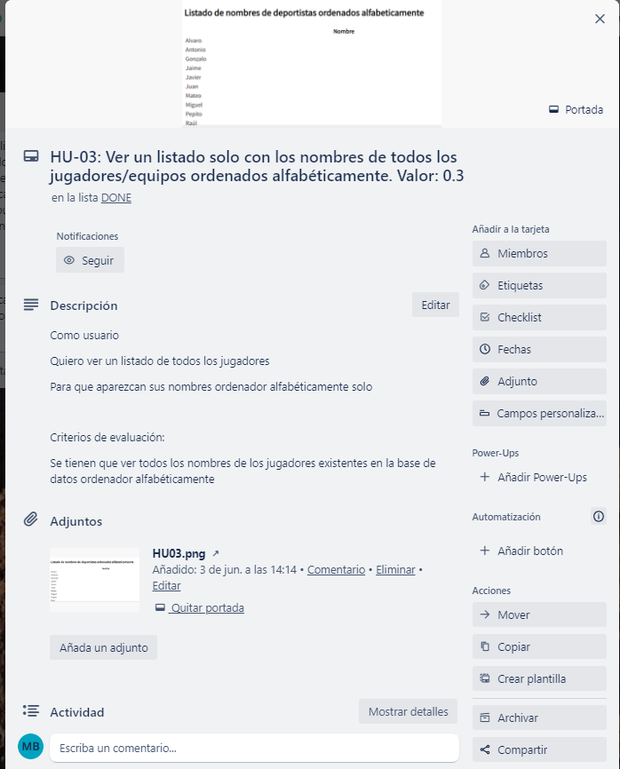
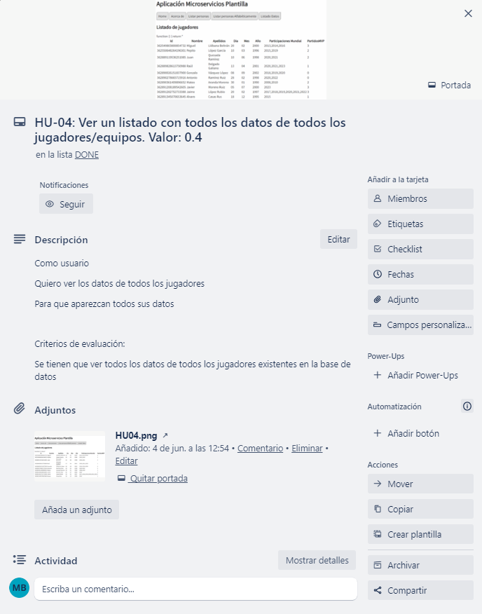
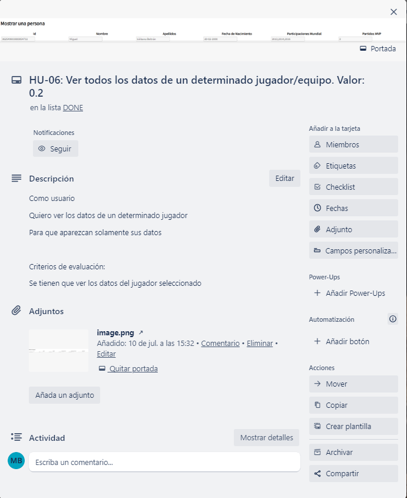

## Practica 3

# Información del estudiante:
* Nombre: Miguel Liébana Beltrán
* Correo: mlb00033@red.ujaen.es
* Tablero de TRELLO: https://trello.com/b/4WwUIBMl/practica3

# PRIMER INCREMENTO
En el primer incremento he desarollado las HU 1, 2, 3 y 4
* HU-1: Ver la información del autor/autora de la aplicación al pulsar en el botón “Acerca de”
)
* HU-2: Ver un listado solo con los nombres de todos los jugadores/equipos.
)
* HU-3: Ver un listado solo con los nombres de todos los jugadores/equipos ordenados alfabéticamente. 
)
* HU-4: Ver un listado con todos los datos de todos los jugadores/equipos
)

# SEGUNDO INCREMENTO
En el primer incremento he desarollado las HU 6, 8, 12
* HU-6: Ver un listado con todos los datos de todos los jugadores/equipos ordenado por el campo del jugador/equipo que el usuario desee.
)
La HU 8 está casi implementada aunque no funciona bien de forma completa.
La HU 12 no ha sido implementada finalmente por falta de tiempo.

# CAPTURAS DE TRELLO
A continuación se mostrarán como quedan las tareas en Trello después de su finalización (y desplazamiento obviamente a la lista DONE)
* HU-1
)
* HU-2
)
* HU-3
)
* HU-4
)
* HU-6
)

# BASE DE DATOS
## Conexión base de datos ##
)

## Colección ##
)

## Jugadores ##
A continuación se mostrará en una tabla los datos, cada jugador consta de un campo ##nombre, un campo ##apellidos, un campo ##fechaNacimiento(compuesto), un campo ##participacionesMundial y un campo ##partidosMVP(numérico) 

Todos los jugadores siguen el siguiente formato en Fauna para ser declarados:
)

Datos de los jugadores:
)