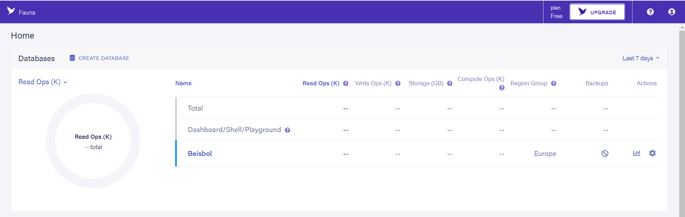
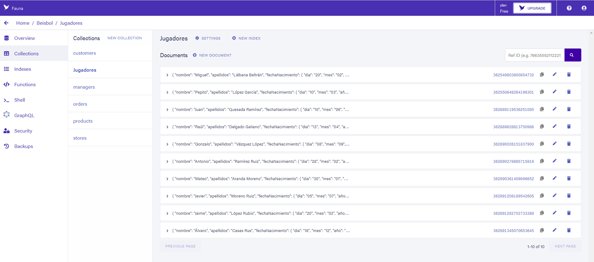
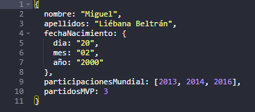

## Practica 3

# Información del estudiante:
* Nombre: Miguel Liébana Beltrán
* Correo: mlb00033@red.ujaen.es
* Tablero de TRELLO: https://trello.com/b/4WwUIBMl/practica3

# PRIMER INCREMENTO
En el primer incremento he desarollado las HU 1, 2, 3 y 4
* HU-1: Ver la información del autor/autora de la aplicación al pulsar en el botón “Acerca de”
* HU-2: Ver un listado solo con los nombres de todos los jugadores/equipos.
* HU-3: Ver un listado solo con los nombres de todos los jugadores/equipos ordenados alfabéticamente. 
* HU-4: Ver un listado con todos los datos de todos los jugadores/equipos

# SEGUNDO INCREMENTO
En el primer incremento he desarollado las HU 5, 8, 12

# BASE DE DATOS
## Conexión base de datos ##
)

## Colección ##
)

## Jugadores ##
A continuación se mostrará en una tabla los datos, cada jugador consta de un campo ##nombre, un campo ##apellidos, un campo ##fechaNacimiento(compuesto), un campo ##participacionesMundial y un campo ##partidosMVP(numérico) 

Todos los jugadores siguen el siguiente formato en Fauna para ser declarados:
)

Datos de los jugadores:
)